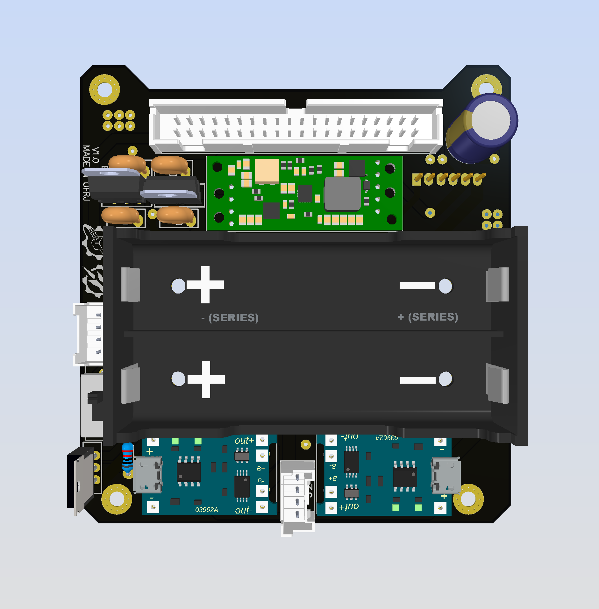

## Objetivo
Duas funções são exercidas simultaneamente nesta placa: (1) fornecimento de energia e (2) regulação desta energia. 
    
1. Duas baterias de lithium-ion (li-ion) modelo 18650 e de voltagem nominal 3.7v são usadas em paralelo. Em conjunto, dois módulos TP4056 são usados para a recarga dessas baterias. É utilizado também um módulo sensor de corrente (INA219) para que sejam avaliadas a todo momento a corrente e a tensão geradas para o circuito.
    
2. Três tensões diferentes são utilizadas por componentes da aviônica. Essas tensões são obtidas no EPS através de três diferentes reguladores de tensão. São utilizados o step-up regulator U3V709 para gerar 9V, o regulador de tensão LM7805 para gerar 5V e o regulador de tensão LD1117V33 para gerar 3.3V. 

Há também um sistema com um MOSFET e duas chaves, uma interna ao circuito e outra externa ao foguete. É a partir desse sistema, chamado de Remove Before Flight (RBF), que a aviônica pode ser mantida desligada enquanto estiver dentro do foguete e só seja acionada no momento do lançamento.

## Componentes
Os componentes da placa são:

|  Componente               |      Qtd      |  Obs  |
| -------------             |  -----------  |  ------ |
| 40 pins flat connector    |       1       | Conector do barramento |
| TP4056                    |       2       | Carrega baterias |
| Battery Holder            |       1       | - |
| 18650 Battery             |       2       | 3.7V |
| Mini-lock connector       |       2       | Para carregar baterias e RBF |
| Slide switch              |       1       | On/Off/RBF |
| MOSFET                    |       1       | RBF |
| INA219                    |       1       | Mede tensão e corrente |
| U3V709                    |       1       | Step-up 3.7V -> 9V |
| LM7085M                   |       1       | Step-down 9V -> 5V |
| LD1117V33                 |       1       | Step-down 9V -> 3.3V |
| Resistor                  |       1       | 1x 10kΩ |
| Capacitor                 |       5       | 1x 33uF, 1x 0.22uF, 1x 0.1uF, 1x 100uF, 1x 10uF |

## Esquemático

## PCB
